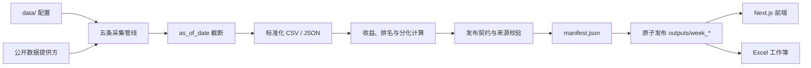

# Capital Weekly Market Data 仓库结构指南

本文面向刚加入项目的工程师，帮助你快速理解仓库边界、代码组织、数据流、运行入口和常见修改位置。

## 1. 项目定位

本仓库是 Capital Weekly 的市场数据后端。它从公开数据源采集跨资产数据，执行时间截断、标准化、收益计算、质量检查和来源审计，最终按自然周发布一套可追溯的数据快照。

核心原则：

- 正式周采用周一至周日窗口，时区为 `Asia/Hong_Kong`。
- 计算快照前必须先应用 `as_of_date`，不能混入目标周日之后的数据。
- 每条业务数据都应保留来源、来源 URL、质量状态和观测日期。
- 五条必需管线全部成功并通过发布校验后，新周才会对前端可见。
- 发布使用临时目录、清单校验和原子替换；失败时保留上一完整周。
- 自动化测试使用确定性数据和模拟运行器，不执行真实网络刷新。

本仓库不负责网页界面。Next.js 前端位于相邻仓库，通过 `MARKET_DATA_ROOT` 读取本仓库的 `outputs/week_*` 发布目录。

## 2. 技术栈

- Python 3.10+
- pandas：时间序列标准化、截断、收益和横截面统计
- requests / yfinance：公开数据源访问
- unittest：Python 测试
- Node.js：工作簿构建和校验
- JSON / CSV：发布数据、审计日志和清单格式

安装 Python 依赖：

```bash
python3 -m pip install -r requirements.txt
```

## 3. 顶层目录

```text
market data/
├── capital_weekly/        # 核心 Python 包：采集、计算、校验和发布
│   └── context/           # 事件、经济数据和市场背景提供方
├── data/                  # 受版本控制的资产范围与提供方配置
├── scripts/               # 面向命令行的运行入口
├── tests/                 # 与生产模块对应的确定性测试
├── docs/                  # 架构设计、实施计划和工程说明
├── outputs/               # 本机生成的周度产物，不提交到 Git
├── README.md              # 项目概览、运行命令和数据使用说明
├── requirements.txt       # Python 依赖
├── AGENTS.md              # Codex/自动化开发约束
└── LICENSE                # MIT License
```

以下本机目录不是稳定的产品接口：

- `.worktrees/`：并行开发使用的 Git worktree，不应被生产代码依赖。
- `outputs/`：生成数据和历史发布，不属于源代码。
- `__pycache__/`、临时 staging 目录和本机部署目录：可由运行过程产生，不应写入业务逻辑。

## 4. 核心包 `capital_weekly/`

### 4.1 市场行情管线

| 模块 | 职责 |
| --- | --- |
| `equity_indices.py` | 读取全球股指配置，调用不同提供方，标准化 OHLCV 历史并生成指数快照。 |
| `equity_sectors.py` | 生成 A 股、港股和美股行业快照，并记录原始缓存与抓取状态。 |
| `gics_sectors.py` | 生成美国 GICS 行业代理数据；当前主要使用 Sector SPDR ETF。 |
| `macro_assets.py` | 处理固定收益、政策利率、货币市场、外汇、商品及登记过的派生序列。 |

这几个模块负责“单条序列怎么抓、怎么解析、怎么转成标准记录”，但不决定整个周何时发布。

### 4.2 通用计算模块

| 模块 | 职责 |
| --- | --- |
| `history.py` | 在快照计算前按 `as_of_date` 截断历史数据，并保留 DataFrame 元数据。 |
| `returns.py` | 计算日、周、MTD、YTD 基准值、基准日期和变化。 |
| `sector_divergence.py` | 计算行业广度、分化、排名和中文事实性摘要。 |
| `macro_divergence.py` | 按资产类别、分组和单位计算宏观分化指标。 |

收益与排名逻辑应集中在这些模块中，不要在 CLI、工作簿或前端重复实现。

### 4.3 周度背景数据

`weekly_context.py` 负责协调事件与背景提供方，将不同来源的结果写入统一分类表和 `source_log.csv`。

`capital_weekly/context/` 的主要边界如下：

| 模块 | 职责 |
| --- | --- |
| `provider_contracts.py` | 定义提供方输入、输出和必需/可选状态契约。 |
| `providers.py` | 注册并组装周度背景提供方。 |
| `events.py` | 解析央行、统计机构等公开日历事件。 |
| `economic_releases.py` | 规范化经济数据发布记录、修订和派生指标。 |
| `economic_sources/bea.py` | BEA 官方发布物解析。 |
| `economic_sources/bls.py` | BLS 官方发布物解析。 |
| `economic_sources/census.py` | Census 官方发布物解析。 |
| `financial_conditions.py` | 金融条件指标及组合统计。 |
| `volatility.py` | Yahoo 波动率指数和已登记期限结构计算。 |
| `market_internals.py` | 市场广度、风格和流动性内部指标。 |
| `microstructure.py` | 沪深港交易所及 Nasdaq 市场结构数据。 |
| `positioning.py` | CFTC、FINRA 等持仓和资金流指标。 |
| `company_events.py` | SEC 公司事件；由 watchlist 控制范围。 |
| `commodities.py` | 可选 EIA 商品基本面数据。 |
| `common.py` | 多个背景提供方共享的日期、数值和校验工具。 |

新增背景提供方时，优先创建职责单一的模块，再通过提供方契约和 `providers.py` 注册，不要把所有解析逻辑堆进 `weekly_context.py`。

### 4.4 发布与迁移

| 模块 | 职责 |
| --- | --- |
| `weekly_release.py` | 计算目标周、运行五条管线、校验文件契约、生成 `manifest.json` 并原子发布。 |
| `release_migration.py` | 检查和迁移旧周目录；迁移不能凭空补造业务数据。 |

`weekly_release.py` 是发布规则的单一事实来源。修改 CSV 表头、必需文件、状态白名单或版本契约时，必须同步更新这里的校验、测试和前端数据契约。

## 5. 配置目录 `data/`

配置文件决定系统“抓什么”和“怎样解释来源”，生产代码不应硬编码资产清单。

| 文件 | 内容 |
| --- | --- |
| `capital_weekly_equity_indices.csv` | 全球股指、ticker、提供方代码、币种和来源。 |
| `capital_weekly_equity_sectors.csv` | A/H/美股行业分类、代理标的和排序。 |
| `capital_weekly_gics_sectors.csv` | GICS 行业代码及 ETF 代理。 |
| `capital_weekly_macro_assets.csv` | 宏观序列、单位、频率、公式和依赖序列。 |
| `capital_weekly_financial_conditions.csv` | 金融条件指标配置。 |
| `capital_weekly_yahoo_volatility.csv` | Yahoo 波动率指数及期限结构配置。 |
| `capital_weekly_cftc_contracts.csv` | CFTC 合约映射。 |
| `capital_weekly_eia_series.csv` | 可选 EIA 序列。 |
| `capital_weekly_company_watchlist.csv` | SEC 公司事件范围；默认可以为空。 |

修改配置时应保留唯一身份字段、提供方、来源名称、来源 URL、单位和说明。新增一行配置通常也需要新增或更新解析测试。

## 6. 命令入口 `scripts/`

### 6.1 正式周度刷新

```bash
python3 scripts/refresh_capital_weekly.py
```

显式重现某个已经结束的周日：

```bash
python3 scripts/refresh_capital_weekly.py --as-of-date 2026-08-09
```

正式刷新会访问公开数据源，并依次执行五条管线：

1. 全球股指
2. 跨市场行业
3. GICS 行业
4. 宏观资产
5. 周度事件与背景

不要为了 UI 测试运行真实刷新。UI 和自动化测试应使用确定性夹具。

### 6.2 单管线诊断

| 脚本 | 用途 |
| --- | --- |
| `fetch_equity_indices.py` | 单独检查全球股指抓取和解析。 |
| `fetch_equity_sectors.py` | 单独检查 A/H/美股行业。 |
| `fetch_gics_sectors.py` | 单独检查 GICS ETF 代理。 |
| `fetch_macro_assets.py` | 单独检查宏观资产和派生序列。 |
| `fetch_weekly_context.py` | 单独检查事件与市场背景提供方。 |

诊断时使用明确截止日期和独立输出目录，避免覆盖正式周：

```bash
python3 scripts/fetch_equity_indices.py \
  --as-of-date 2026-08-09 \
  --output-dir outputs/manual-equity-indices
```

### 6.3 历史迁移与工作簿

| 脚本 | 用途 |
| --- | --- |
| `migrate_capital_weekly_releases.py` | 使用 `--dry-run` 只读检查旧周；正式迁移采用回滚安全的目录替换。 |
| `build_weekly_workbooks.mjs` | 从最新合格周构建四个 Excel 工作簿。 |
| `verify_weekly_workbooks.mjs` | 校验工作簿结构和内容。 |

## 7. 端到端数据流



发布过程的关键阶段：

1. 根据香港时区确定最近一个已结束周日。
2. 在 staging 周目录运行五条管线。
3. 检查必需文件、表头、数值、日期边界、来源和状态。
4. 生成包含行数和 SHA-256 的 `manifest.json`。
5. 通过目录交换将 staging 周变成正式周。
6. 任一步失败时，不替换上一完整周。

## 8. 发布目录 `outputs/`

正式目录使用 `week_YYYYMMDD-YYYYMMDD` 命名：

```text
outputs/week_20260803-20260809/
├── manifest.json
├── capital_weekly_equity_indices_python_20260809/
│   ├── 02_equity_indices.csv
│   ├── equity_indices_snapshot.json
│   ├── source_log.csv
│   └── raw/
├── capital_weekly_equity_sectors_python_20260809/
│   ├── 03_equity_sectors.csv
│   ├── sector_divergence.csv
│   ├── equity_sectors_snapshot.json
│   ├── source_log.csv
│   └── raw/
├── capital_weekly_gics_sectors_python_20260809/
│   ├── 03_gics_sectors.csv
│   ├── gics_sectors_snapshot.json
│   ├── source_log.csv
│   └── raw/
├── capital_weekly_macro_assets_python_20260809/
│   ├── fixed_income.csv
│   ├── policy_rates.csv
│   ├── money_market.csv
│   ├── foreign_exchange.csv
│   ├── commodities.csv
│   ├── macro_divergence.csv
│   ├── macro_assets_snapshot.json
│   └── source_log.csv
├── capital_weekly_context_20260809/
│   ├── events.csv
│   ├── financial_conditions.csv
│   ├── market_internals.csv
│   ├── positioning_flows.csv
│   ├── company_events.csv
│   ├── commodity_fundamentals.csv
│   ├── weekly_context_snapshot.json
│   └── source_log.csv
└── 01_股票指数_*.xlsx ... 04_事件与市场背景_*.xlsx
```

部分周可能包含可选的 `history_catalog.csv` 和 `history/*.csv`。是否可用必须以该周 `manifest.json` 和目录校验结果为准，不能从另一周静默补数据。

不要手工修改正式周 CSV。需要修复发布数据时，应使用受测试的迁移、回填或重新发布流程，并保留原子回滚能力。

## 9. 测试结构

测试文件通常与生产模块一一对应：

```text
capital_weekly/equity_indices.py
└── tests/test_capital_weekly_equity_indices.py

capital_weekly/context/economic_sources/bls.py
└── tests/test_capital_weekly_economic_bls.py

capital_weekly/weekly_release.py
└── tests/test_capital_weekly_weekly_release.py
```

运行完整验证：

```bash
python3 -m unittest -v
node --test tests/test_verify_weekly_workbooks.mjs
```

开发时先运行当前模块的 focused test，再运行完整套件。例如：

```bash
python3 -m unittest -v tests.test_capital_weekly_equity_indices
python3 -m unittest -v
```

测试应覆盖：

- 提供方响应解析和错误分支
- `as_of_date` 截止边界
- 收益、排名和派生公式
- 空表及标准表头
- 来源 URL、质量状态和审计信息
- staging 校验、manifest 哈希和原子回滚
- 可选提供方失败不掩盖错误，也不破坏必需发布契约

## 10. 常见修改位置

### 新增或调整一个市场序列

1. 修改 `data/` 下对应 universe CSV。
2. 在对应行情模块中确认提供方 dispatch 和解析器。
3. 保证时间截断发生在快照计算之前。
4. 更新对应的 fetcher 测试。
5. 如果发布字段变化，更新 `weekly_release.py` 和前端契约。

### 新增一个周度背景提供方

1. 在 `capital_weekly/context/` 创建聚焦的解析或计算模块。
2. 在 `provider_contracts.py` 定义必需性和输出分类。
3. 在 `providers.py` 注册提供方。
4. 在 `weekly_context.py` 中只做协调，不复制解析逻辑。
5. 添加提供方测试、截止日期测试和失败状态测试。

### 修改收益或分化口径

- 收益基准：`returns.py`
- 行业排名和评论：`sector_divergence.py`
- 宏观排名和评论：`macro_divergence.py`

口径变化需要使用手工推导的固定测试值，避免测试重复调用生产公式计算期望结果。

### 修改发布契约

发布契约修改通常跨越：

- `capital_weekly/weekly_release.py`
- 对应管线的 CSV 写出逻辑
- `tests/test_capital_weekly_weekly_release.py`
- 迁移兼容逻辑
- 相邻 Next.js 仓库的数据契约和夹具

这类改动必须协调版本兼容，不能让旧周突然无法选择。

### 修改工作簿

- 构建：`scripts/build_weekly_workbooks.mjs`
- 校验：`scripts/verify_weekly_workbooks.mjs`
- 测试：`tests/test_verify_weekly_workbooks.mjs`

## 11. 与前端仓库的关系

前端通过服务端环境变量定位本仓库：

```bash
export MARKET_DATA_ROOT="/absolute/path/to/market-data"
```

接口边界是已发布周目录，不是 Python 内部对象：

```text
market-data outputs/week_*
        │
        ├── manifest.json
        ├── normalized CSV / JSON
        └── source logs
                │
                ▼
Next.js server-side loaders
                │
                ▼
Capital Weekly terminal UI
```

后端新增字段不代表前端会自动展示。涉及发布字段、文件名、数据集身份或契约版本的修改，应在两个仓库中分别测试和提交。

## 12. 新工程师建议阅读顺序

1. 阅读根目录 `README.md`，了解运行方法和使用限制。
2. 阅读 `scripts/refresh_capital_weekly.py`，找到正式入口。
3. 阅读 `capital_weekly/weekly_release.py`，理解完整周和原子发布。
4. 选择一个数据域，例如 `equity_indices.py`，沿配置、抓取、计算、写出和测试走一遍。
5. 阅读 `weekly_context.py`、`context/provider_contracts.py` 和 `context/providers.py`，理解背景提供方模型。
6. 查看一个真实 `outputs/week_*` 目录，对照 `manifest.json`、业务表和 `source_log.csv`。
7. 运行 focused test 和完整 unittest，确认本机环境正常。

## 13. 开发注意事项

- 不要删除历史 `outputs/week_*` 来“清理仓库”；它们是本机发布记录。
- 不要把真实网络刷新当成普通测试步骤。
- 不要把缺失值写成零，也不要插值或伪造数据。
- 不要在快照计算后才应用截止日期。
- 不要忽略 `source_log.csv`；业务表存在不等于所有来源成功。
- 不要直接依赖 `.worktrees/`、staging 目录或本机绝对路径。
- 保留工作树中与当前任务无关的修改和生成文件。
- 提交前运行 focused tests、完整 unittest 和与工作簿相关的 Node 测试。

遇到数据问题时，优先沿以下链路排查：

```text
data/ 配置
→ provider dispatch
→ 原始响应或缓存
→ 标准化历史
→ as_of_date 截断
→ 快照与派生计算
→ CSV/source_log
→ weekly_release 校验
→ manifest
→ 前端加载
```
